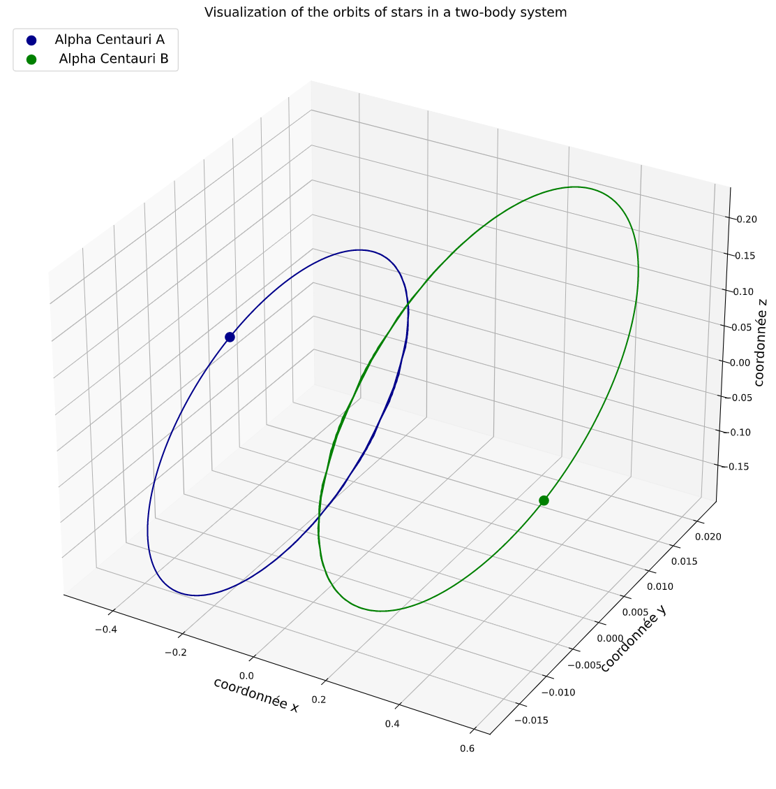
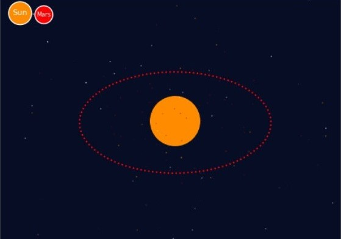
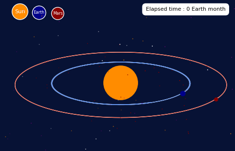

# Introduction

## Présentation du problème

- Approche historique  
- Approche mathématiques  

## Plan

- Résolutions mathématiques  
- Visualisation  
- Conclusion  

# Résolutions mathématiques

## Première approche : Alpha Centauri A et Alpha Centauri B

$$\overrightarrow{F} = \frac{Gm_1m_2}{r^2}\widehat{r}$$

$$m_1\frac{d{^2} \overrightarrow{r_1}}{dt^2} = \frac{Gm_1m_2}{r^3}r_{12}$$

## Problème à 3 corps

$${\displaystyle {\begin{aligned}{\ddot {\mathbf {r} }}_{\mathbf {1} }
   &=-Gm_{2}{\frac {\mathbf {r_{1}} -\mathbf {r_{2}} }{|\mathbf {r_{1}} -\mathbf {r_{2}} |^{3}}}-Gm_{3}{\frac {\mathbf {r_{1}} -\mathbf {r_{3}} }
   {|\mathbf {r_{1}} -\mathbf {r_{3}} |^{3}}},\\{\ddot {\mathbf {r} }}_{\mathbf {2} }
   &=-Gm_{3}{\frac {\mathbf {r_{2}} -\mathbf {r_{3}} }{|\mathbf {r_{2}} -\mathbf {r_{3}} |^{3}}}-Gm_{1}{\frac {\mathbf {r_{2}} -\mathbf {r_{1}} }
   {|\mathbf {r_{2}} -\mathbf {r_{1}} |^{3}}},\\{\ddot {\mathbf {r} }}_{\mathbf {3} }&=-Gm_{1}{\frac {\mathbf {r_{3}} -\mathbf {r_{1}} }
   {|\mathbf {r_{3}} -\mathbf {r_{1}} |^{3}}}-Gm_{2}{\frac {\mathbf {r_{3}} -\mathbf {r_{2}} }{|\mathbf {r_{3}} -\mathbf {r_{2}} |^{3}}},\end{aligned}}}$$  

# Visualisation

## Alpha Centauri A et Alpha Centauri B

\center

{width=75%}

## Trajectoires de la Terre et de Mars autour du soleil

\center

{width=75%}

## Problème à 3 corps

\center

{width=75%}