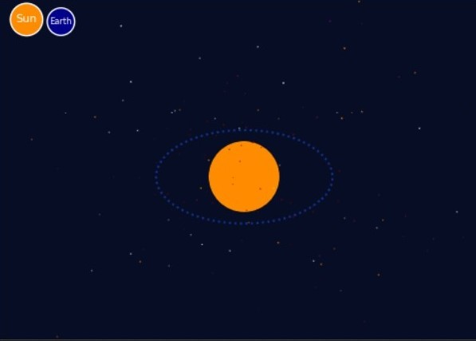
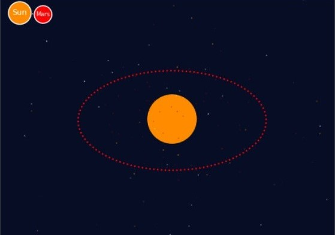

# Introduction

## Présentation du problème

- Approche historique  
- Approche physique  
  - Problème à $n$ corps
  - Problème à $2$ puis $3$ corps
- Approche mathématiques  

## Plan

- Résolutions mathématiques  
  - Problème à $2$ corps 
  - Problème à $3$ corps  
- Visualisation  
  - Alpha Centauri A et Alpha Centauri B  
  - Trajectoire de la Terre autour du soleil  
  - Trajectoire de Mars autour du soleil  
  - Problème à 3 corps  
- Conclusion  

# Résolutions mathématiques

## Première approche : Alpha Centauri A et Alpha Centauri B

- Force d'attraction gravitationnelle entre $2$ corps :  

$$\overrightarrow{F} = \frac{Gm_1m_2}{r^2}\widehat{r}$$

- Principe fondamental de la dynamique :  

$$m_1\frac{d{^2} \overrightarrow{r_1}}{dt^2} = \frac{Gm_1m_2}{r^3}r_{12}$$

## Problème à 3 corps

- Équations Newtoniennes du mouvement :   

$${\displaystyle {\begin{aligned}{\ddot {\mathbf {r} }}_{\mathbf {1} }
   &=-Gm_{2}{\frac {\mathbf {r_{1}} -\mathbf {r_{2}} }{|\mathbf {r_{1}} -\mathbf {r_{2}} |^{3}}}-Gm_{3}{\frac {\mathbf {r_{1}} -\mathbf {r_{3}} }
   {|\mathbf {r_{1}} -\mathbf {r_{3}} |^{3}}},\\{\ddot {\mathbf {r} }}_{\mathbf {2} }
   &=-Gm_{3}{\frac {\mathbf {r_{2}} -\mathbf {r_{3}} }{|\mathbf {r_{2}} -\mathbf {r_{3}} |^{3}}}-Gm_{1}{\frac {\mathbf {r_{2}} -\mathbf {r_{1}} }
   {|\mathbf {r_{2}} -\mathbf {r_{1}} |^{3}}},\\{\ddot {\mathbf {r} }}_{\mathbf {3} }&=-Gm_{1}{\frac {\mathbf {r_{3}} -\mathbf {r_{1}} }
   {|\mathbf {r_{3}} -\mathbf {r_{1}} |^{3}}}-Gm_{2}{\frac {\mathbf {r_{3}} -\mathbf {r_{2}} }{|\mathbf {r_{3}} -\mathbf {r_{2}} |^{3}}},\end{aligned}}}$$  

# Visualisation

## Alpha Centauri A et Alpha Centauri B

\center

{width=75%}

## Trajectoire de la Terre autour du soleil

\center

{width=75%}

## Trajectoire de Mars autour du soleil

\center

{width=75%}

## Problème à 3 corps

\center

{width=75%}

# Conclusion

- Création d’un package python  
- Plus d’informations disponibles sur le dépôt git  
- Pour aller plus loin : problème à $4$ corps, $5$ corps, etc…  
